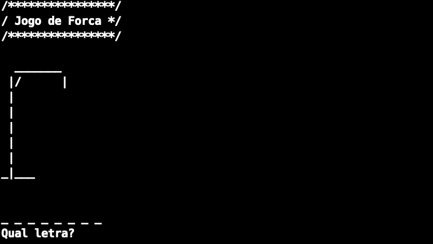
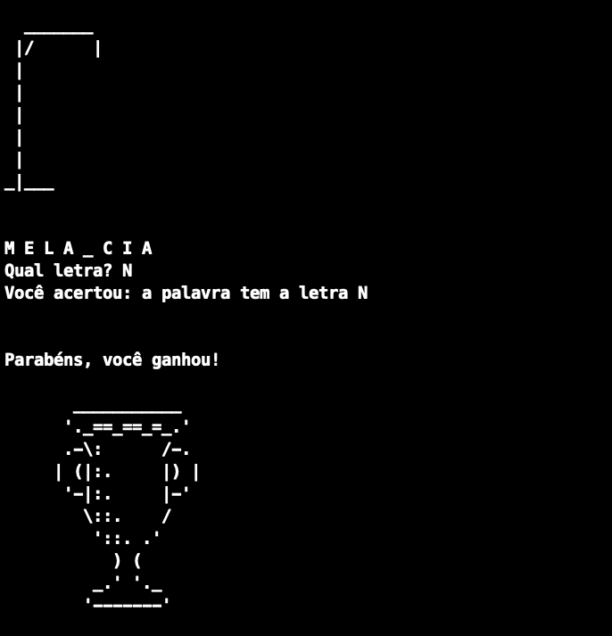
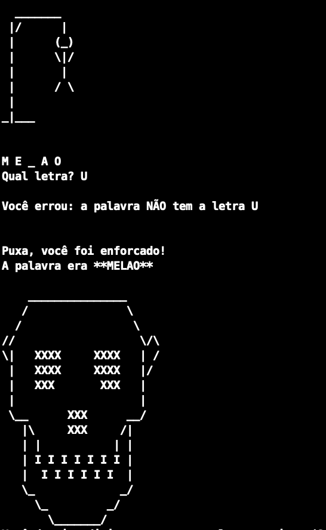

# ✨ Jogo Forca

<h1 align="center">
  
</h1>

### ALURA 🚀  C II - Avançado na linguagem

- ### 💻 C
    - 01-Arrays
    - 02-Binários
    - 03-Funçoes
    - 04-Ponteiros
    - 05-Headers
    - 06-I/O

- ### 🖥 Rodar o Jogo
    - 01-Clone

            git clone https://github.com/wwwillian/Jogo_C_Forca.git

    - 02-Entre na pasta

            cd Jogo_C_Forca

    - 03-Rode o comando para compilar o arquivo em C

            gcc main.c mapa.c ui.c -o main.out 

    - 04-Rode o jogo

            ./main.out 

- ### 🕹 Jogar o jogo
    - Informe a letra e aperte "Enter"

<h1 align="center">

  
     
    
  
</h1>

### 📝 Licença
Esse projeto está sob a licença MIT. Veja o arquivo LICENSE para mais detalhes.

